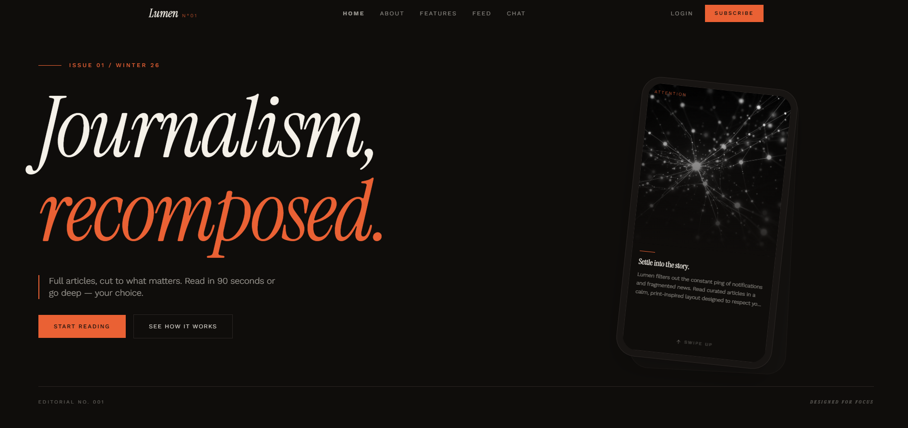
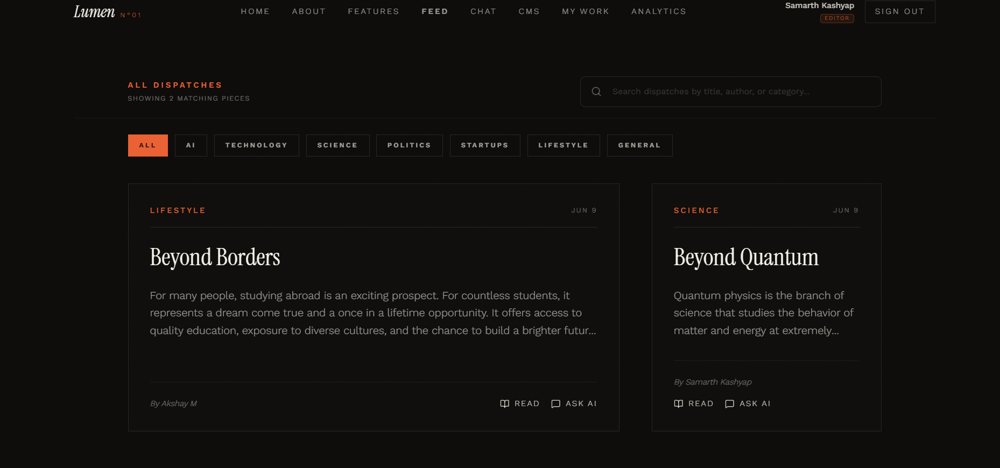
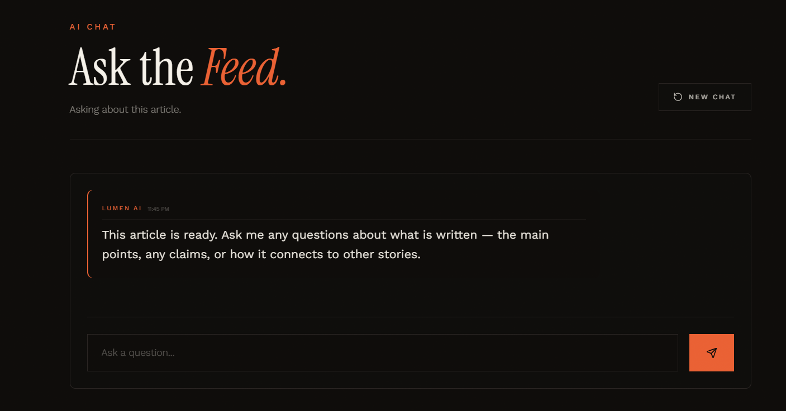
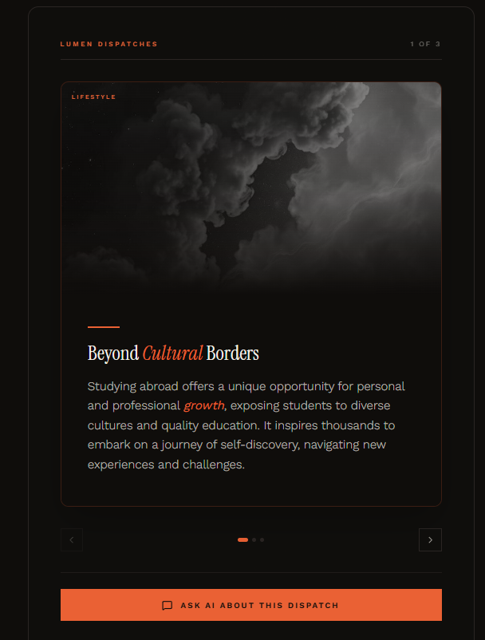

# Lumen

**Read smarter, not longer.**

**Live Demo:** [https://lumenbrief.vercel.app](https://lumenbrief.vercel.app)

I built Lumen because reading anything online had become painful. You click on an article and before you even get to the first sentence, there's a cookie banner, a newsletter popup, an autoplay video, and ads squeezed between every other paragraph. The content itself might be great, but good luck actually focusing on it.

Lumen fixes that. Submit any article link, and a pipeline of AI agents pulls out the 3 key takeaways as swipeable cards. Same format Instagram and TikTok proved keeps people engaged — except here it's used for actually learning something.

Interested? Tap in and read the full article, clean and distraction-free. Not worth it? You lost 90 seconds. For writers, just submit your piece — the AI handles summaries, formatting, and publishing.

---

## Screenshots

| Landing Page | Article Feed |
| ------------ | ------------ |
|  |  |

| RAG Chat | Reader View |
| -------- | ----------- |
|  |  |

---

## Features

**Readers**

- Swipe through 3 summary cards per article
- Tap into the full article in a clean, ad-free reading view
- Ask the AI questions about any article, or search across all of them
- Filter by category, browse trending topics

**Writers**

- Submit articles by URL or write directly in the built-in, clean distraction-free editor
- AI pipeline runs automatically — reads, summarizes, checks, polishes, publishes
- Analytics dashboard to track views and reads

---

## The AI Pipeline

When an article is submitted, it goes through the following pipeline:

| Step | Agent               | What it does                                                                                                         |
| ---- | ------------------- | -------------------------------------------------------------------------------------------------------------------- |
| 1    | **Chunker**         | Splits the article into smaller text chunks for processing                                                           |
| 2    | **Embedding Agent** | Generates vector embeddings using `all-MiniLM-L6-v2` (HuggingFace) and stores them in pgvector for similarity search |
| 3    | **Analyzer**        | Uses Groq LLM to identify themes, tone, and key takeaways — produces a structured blueprint                          |
| 4    | **Generator**       | Takes the blueprint and generates 3 summary cards with titles, descriptions, and category tags                       |
| 5    | **Validator**       | Cross-references the generated cards against the original text to catch hallucinations or inaccuracies               |
| 6    | **Optimizer**       | Polishes wording, applies markdown formatting, bolds key terms for readability                                       |
| 7    | **Publisher**       | Writes the final article, cards, and chunks to Supabase (PostgreSQL)                                                 |

Agents 3, 4, 5, and 6 are LLM-powered (Groq / Llama). Agents 1, 2, and 7 are standard data processing steps.

## RAG Chat

The chat feature uses Retrieval-Augmented Generation. When a user asks a question, the query is converted to embeddings and is searched in the DB to find similar embeddings. Relevant embeddings are retrieved and are fed to the LLM to generate a response.

---

## Architecture

```
Article Submission
        │
        ▼
    Chunker
        │
        ▼
 Embedding Agent ──► pgvector (vector store)
        │
        ▼
    Analyzer
        │
        ▼
    Generator
        │
        ▼
    Validator
        │
        ▼
    Optimizer
        │
        ▼
    Publisher
        │
        ▼
 PostgreSQL / Supabase
        │
        ├── Feed
        ├── Reader
        ├── CMS
        └── RAG Chat (query → embed → similarity search → LLM)
```

---

## Tech Stack

| Layer    | Tools                                                    |
| -------- | -------------------------------------------------------- |
| Frontend | React, TypeScript, TanStack Router, Tailwind CSS, Motion |
| Backend  | Python, FastAPI, Celery, Redis                           |
| AI       | Groq (Llama), HuggingFace sentence-transformers          |
| Database | Supabase (PostgreSQL + pgvector)                         |
| Hosting  | Vercel (frontend), Render (backend)                      |

---

## Project Structure

```
lumen-saas/
├── src/
│   ├── components/         # UI components
│   ├── routes/             # All pages (feed, chat, cms, reader, etc.)
│   ├── lib/                # Auth, config, utilities
│   └── assets/             # Images
├── backend/
│   ├── main.py             # API server
│   ├── celery_worker.py    # Background task runner
│   ├── agents/             # AI pipeline agents
│   ├── .env.example        # Environment variable template
│   └── supabase/migrations # Database schema
└── package.json
```

---

## Running Locally

### You'll need

- Node.js 18+
- Python 3.10+
- A [Groq API key](https://console.groq.com/keys) (free tier works)
- Supabase project (optional — falls back to a local JSON file)

### Backend

```bash
cd backend
python -m venv venv
source venv/bin/activate   # Windows: venv\Scripts\activate
pip install -r requirements.txt
cp .env.example .env       # Add your API keys
python main.py
```

Starts at `http://localhost:8000`. Works without Supabase — uses a local file as fallback.

### Frontend

```bash
npm install
npm run dev
```

Starts at `http://localhost:3000`.

---

## Pages

| Route         | Page                                          |
| ------------- | --------------------------------------------- |
| `/`           | Landing page                                  |
| `/feed`       | Article feed with swipeable cards             |
| `/reader/:id` | Full article reader                           |
| `/chat`       | AI chat                                       |
| `/features`   | Feature showcase                              |
| `/about`      | Why Lumen exists                              |
| `/tech-stack` | How the AI pipeline works                     |
| `/cms`        | Editor dashboard — submit and manage articles |
| `/analytics`  | Performance stats for editors                 |

---

## What I Learnt

- **Multi-agent pipelines** — How multi agent system works and how they communicate with each other.
- **RAG from scratch** — embedding text with sentence-transformers, storing vectors in pgvector, running similarity searches, and injecting retrieved context into LLM prompts
- **Full-stack deployment** — wiring a React frontend (Vercel) to a Python backend (Railway) with environment-based API routing
- **Prompt engineering** — writing structured prompts that consistently return valid JSON, and how small wording changes can dramatically change output quality
- **Vector databases** — What a vector database is and how it works. Use of pgvector extension in PostgreSQL.
- **Type-safe routing** — TanStack Router's file-based routing with full TypeScript inference

---

## License

Portfolio project. Feel free to look around and learn from it.
